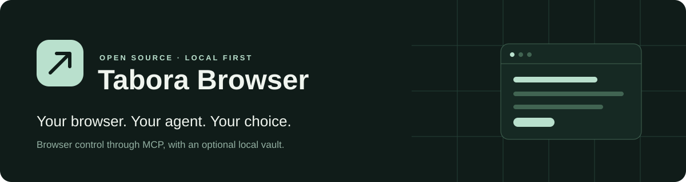

<p align="center">
  <a href="https://github.com/halatao/tabora-browser/actions/workflows/ci.yml"></a>
  <a href="LICENSE"></a>
  
  
</p>

<p align="center">
  <a href="#get-started">Get started</a> ·
  <a href="#choose-your-mode">Modes</a> ·
  <a href="#choose-who-decides">Models</a> ·
  <a href="#measured-results">Results</a> ·
  <a href="docs/technical-reference.md">Technical reference</a>
</p>

**Let your AI agent work in your browser, with the model you choose.**

Tabora connects local AI agents to Chrome, Edge or a managed Chromium profile through MCP. The extension reads pages and executes browser actions; a small local host connects the agent, profiles and optional encrypted vault.

Use your connected Codex or Claude agent directly, or let Tabora's internal controller use a selected decision provider. The everyday controls stay simple: **mode, provider, model and vault**.

> [!NOTE]
> Windows preview. The extension UI is currently in Czech; MCP descriptions are in English. MIT licensed. Not yet published to the Chrome Web Store.

## What you can do

| Capability | What it covers |
| --- | --- |
| **Read pages** | Text, tables, forms, supported frames and shadow DOM, plus scoped document readers. |
| **Take action** | Click, type, select options and use supported native mouse/keyboard interactions. |
| **Organize work** | Named tab groups, multiple profiles and takeover of existing tabs when permitted. |
| **Attach files** | Import or stream files and attach them to a website within configured file roots. |
| **Work in the background** | Supported interactions without activating the tab or restoring its window. |
| **Use credentials** | Optional vault filling into the credential's exact HTTPS origin. |

Coverage depends on the page and operation. See the [capability matrix](docs/capability-matrix.md) and [contracts and limits](docs/capabilities.md).

## Get started

**You need:** Windows 10/11, Git and Node.js **22.13+**. No administrator rights required. Keep the checkout in a permanent directory.

### Recommended: a dedicated browser profile

```powershell
git clone https://github.com/halatao/tabora-browser.git
cd tabora-browser
powershell.exe -NoProfile -ExecutionPolicy Bypass -File scripts/setup.ps1 -Managed -Client auto
```

Setup installs dependencies, builds Tabora, registers its local host and available Codex/Claude MCP clients, and opens a dedicated Chromium profile with the extension loaded. **Restart your MCP client** afterward.

Verify the connection:

```powershell
npm run doctor -- --require-profile
```

Model API keys are not required when the connected agent chooses actions through MCP.

<details>
<summary><strong>Use your existing Chrome or Edge profile</strong></summary>

Run setup without `-Managed`:

```powershell
powershell.exe -NoProfile -ExecutionPolicy Bypass -File scripts/setup.ps1 -Client auto
```

1. Open `chrome://extensions` or `edge://extensions` in the intended profile.
2. Enable **Developer mode**, choose **Load unpacked**, and select `dist/extension` from this checkout.
3. Open Tabora's side panel. The host connects automatically; new profiles start in Safe mode with MCP enabled and the vault off.
4. Run `npm run doctor -- --require-profile`.

Chrome handles installation/update permission consent. Profile names are detected from local metadata; if several profiles match, the panel asks you to choose once. Explicit MCP revocation is preserved.

</details>

<details>
<summary><strong>Headless setup, restricted sites and client selection</strong></summary>

```powershell
powershell.exe -NoProfile -ExecutionPolicy Bypass -File scripts/setup.ps1 -Managed -Client codex -Profile work -AllowOrigin https://example.com -Headless
```

Use `-Client claude`, `both` or `none` for explicit registration. `auto` registers available clients. `-AllowOrigin` restricts the managed copy to selected sites; the default extension requests HTTP(S), debugger and downloads access during installation.

[Full installation and permissions reference](docs/technical-reference.md#quick-start)

</details>

## Choose your mode

| Mode | Best for | What the agent can control |
| --- | --- | --- |
| **Safe** · default | A separate workspace per task | Its own new tabs in a named group, normally in an existing window. |
| **Risk / Takeover** | Continuing work in an open page | Existing permitted tabs, with one session owning a tab at a time. |
| **Read only** | Research and extraction | Readable content; Tabora rejects writes. |

Safe shares the profile's cookies and website logins; it is not incognito. Read only prevents Tabora writes, while the website's own JavaScript can still run. Changing modes invalidates prepared actions.

## Choose who decides

| Provider | Connection | Availability |
| --- | --- | --- |
| **Connected agent / MCP** · default | Your calling agent chooses the action | No extra decision-model call |
| **Codex SDK** | Existing local SDK login or optional API key | Supported |
| **Claude Agent SDK** | Existing local SDK login or optional API key | Supported |
| **TypeSafe / Jev** | `TYPESAFE_API_KEY`, `JEV_API_KEY` or optional vault key | Supported |
| **OpenAI Decisions API** | Reserved adapter | Unavailable pending a verified API contract |

Choose a provider and a model from its catalog — no free-text model IDs. Missing login or credentials appear inline. The first decision validates actual model access.

Agents can also [configure the decision model through MCP](docs/technical-reference.md#optional-vault-and-decision-providers). Model configuration is shared across profiles using the same host; active provider selection is per profile.

## Vault, when you need it

**Off by default.** Enable and explicitly unlock it in the panel.

- Save credentials **per profile**, or explicitly share them across profiles.
- Each profile has its own unlock grant and timeout.
- Login uses a credential ID and the exact bound HTTPS origin. Passwords and provider keys are not returned through MCP or sent to decision models.

Storage uses AES-256-GCM with a Windows DPAPI-protected key. It is local to the Windows user, with no cloud sync or cross-machine recovery. Profile scoping is not a security boundary against arbitrary processes running as that same user.

## Measured results

The latest compatibility pilot used [The Internet](https://the-internet.herokuapp.com/) in **normal Chrome**, with nine valid goals covering tables, dropdowns, checkboxes, dynamic controls, element tracking and shadow DOM.

| Configuration | Completed | Mean end-to-end time |
| --- | ---: | ---: |
| Official extension + calling Codex agent | **9 / 9** | 15.07 s |
| Tabora + Jev 1.13.0 | **9 / 9** | **2.93 s** |
| Tabora + Codex SDK gpt-6-luna | **9 / 9** | **7.23 s** |

> [!IMPORTANT]
> **Tabora was faster in this run.** One development-exposed repetition, locally authored goals and scoring. Profile/cache equality and the official backend model are not attested. One upstream iframe editor remains excluded. This does not establish general speed superiority or production stability.

[Full comparison and timings](docs/benchmarks/chrome-comparison-2026-10-04.md) · [Recorded data](docs/benchmarks/chrome-comparison-2026-10-04.json) · [Methodology](docs/benchmarks/README.md)

The [original failed pilot](docs/benchmarks/internet-2026-10-04.md) remains available. This is **not an independent WebArena score**. A full WebArena-Verified comparison has [preparation notes and blockers](docs/benchmarks/webarena-full-run.md), but no completed score yet.

## How the pieces fit

```text
Your AI agent              Local host                 Browser extension
Codex / Claude / MCP  ──►  Profiles + routing     ──►  Read + execute + verify
                          Optional vault             Owned tabs and groups
                          Decision providers
```

Models choose bounded operations; the extension executes them against the observed document. Sessions own their tabs, prepared actions are single-use, and uncertain writes are not replayed automatically.

[Architecture](docs/architecture-delivery-2026-10-04.md) · [Background execution](docs/background-execution.md) · [Decision runtime](docs/decision-runtime.md)

## Everyday commands

```powershell
npm run browser -- start --profile work
npm run browser -- status --profile work
npm run browser -- stop --profile work
npm run doctor -- --require-profile
```

To update, stop managed profiles, run `git pull --ff-only` and rerun setup. Reload unpacked extensions in ordinary Chrome/Edge profiles. Keep the installed checkout at its original path.

[Data locations, removal and troubleshooting](docs/technical-reference.md#data-updates-and-removal)

## For developers

```powershell
npm ci
npm run check
```

Browser integration tests also require native-host registration and Playwright Chromium. See [development commands and test scope](docs/technical-reference.md#development-and-validation).

| Read next | Contents |
| --- | --- |
| [Technical reference](docs/technical-reference.md) | Setup, profiles, MCP flow, providers, updates and troubleshooting |
| [Capabilities](docs/capabilities.md) | API contracts and supported operations |
| [Capability matrix](docs/capability-matrix.md) | Coverage and remaining limits |
| [File attachments](docs/file-attachments.md) | Automatic imports, streams and uploads |
| [Benchmarks](docs/benchmarks/README.md) | Protocol, results and historical failures |

CAPTCHA/MFA and OS dialogs require handoff. Jev image support remains unverified; native WebMCP is experimental and opt-in. Check the capability documents before relying on a particular workflow.

---

[MIT licensed](LICENSE) · Built for local agents · Chrome, Edge and managed Chromium
