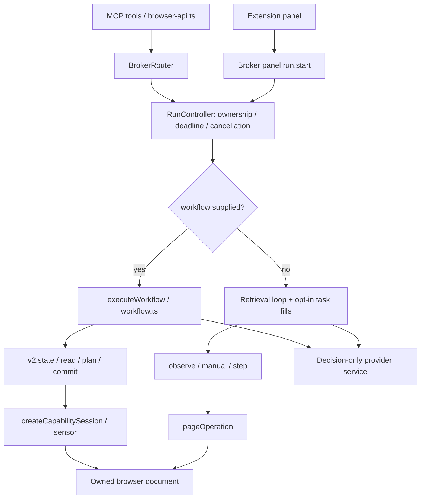
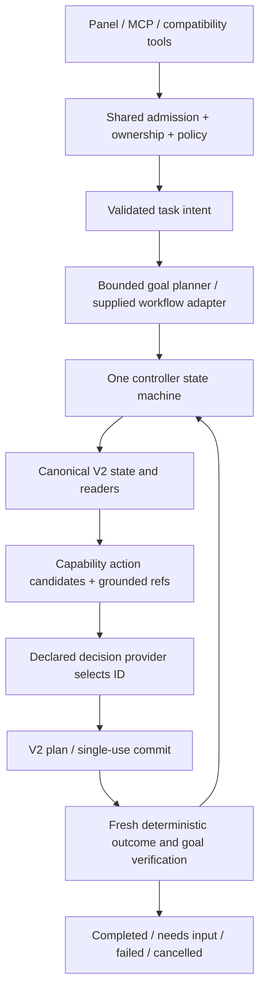

# Architecture audit and migration plan — 2026-10-04

The actionable stage-by-stage backlog, cleanup inventory and acceptance gates are
in the [implementation and cleanup plan](architecture-implementation-plan.md).

## Conclusion and scope

The repository has a working capability execution layer, but not one unified autonomous agent. Two host controllers and two browser observation/action contracts remain active. Broad capability tests exercise explicit tools or caller-authored workflows; plain-goal product tests exercise the older retrieval controller. A new capability therefore does not automatically become usable from the product's autonomous entry point.

This audit inspects the source entry points, ownership/policy boundaries, controller selection, observation/action schemas, provider adapters, lifecycle and test structure. The online pilot supplies observed failures. It is a source and integration audit, not a penetration test, an exhaustive provider-runtime audit or proof of browser behavior for every capability.

The immediate change adds an execution identity to actual run start/status results, with a regression test. **The unified controller and natural-language planning are not implemented by this change.** No controller has been silently disabled, no compatibility tool removed, and no provider/executor switched under existing clients.

## Current architecture

Relevant code: `host/broker.ts`, `host/broker-router.ts`, `host/run-controller.ts`, `host/workflow.ts`, `extension/session.ts`, `extension/v2-session.ts`, `extension/page.ts`, `extension/sensor.ts`, `browser-api.ts`, `capabilities.ts`, `shared.ts`.

## Findings and disposition

| Priority | Finding / evidence | Consequence | Required disposition |
| --- | --- | --- | --- |
| P0 | `RunController.loop` branches on presence of `options.workflow`; otherwise uses legacy snapshots and recipes. `task:true` only adds literal fills. | New capabilities are bypassed by plain goals. | One canonical controller over V2; compatibility inputs translated at the edge. Remove the legacy autonomous loop only after parity. |
| P0 | `workflowSchema` requires exactly one caller-supplied success/answer/download completion contract. No general goal-to-workflow planner exists. | Sending a goal to the new controller alone cannot solve or verify arbitrary tasks. | Add bounded goal planning and observed-reference grounding. Do not assume `workflowSchema.parse({})` is a migration. |
| P0 | Legacy `finish_*` choices are evidence-derived answer facts; state-changing goals lack a general completion contract. Luna reached three goals but did not terminate successfully. | False failure after correct action; subsequent unrelated action can damage a completed state. | Shared deterministic terminal verifier for action outcomes, desired state and ordered obligations. A model's claim of completion is insufficient. |
| P1 | Legacy candidates cover table/text/link/button/select and literal form fills. V2/workflow separately supports checks, frames, edits, native input and other capabilities. | Models cannot choose operations that were never offered. | Capability-based action registry shared by explicit tools and autonomous execution; declare supported action, permission, modality and verification. |
| P1 | `answerFacts` normalizes currency via decimal helpers; `listAnswerFacts` separately uses a plain-number regex and `Number`. | Currency ranking fails; precision behavior differs between answer paths. | Consolidate bounded evidence transformations using existing decimal utilities; preserve original display/evidence and locale ambiguity. |
| P1 | Legacy recovery re-observes `stale_snapshot`, `target_not_ready`, `target_obscured`; it does not establish the goal-specific readiness condition. | Repeated premature action, then failure. | Shared bounded recovery: inspect dispatch outcome, wait on an explicit predicate, refresh refs. Never replay uncertain side effects. |
| P1 | Legacy action ranking still offers unrelated page links. Exact-origin policy blocks unsafe navigation correctly. | Wrong candidate choice becomes terminal failure. | Filter and rank by task scope using observed href/origin before selection; keep origin enforcement at execution. Do not relax policy to improve score. |
| P1 | `broker.ts` panel and `broker-router.ts` MCP independently apply provider preference and assemble run inputs. | Future drift between product entry points. | Shared validated run admission function; retain independent ownership checks appropriate to each transport. Contract-test both entry points. |
| P1 | Legacy and V2 execution are implemented inside the same session, with separate snapshots/plans and navigation handling. | Duplicate invalidation/readiness semantics; deleting legacy files now breaks public tools. | Compatibility facade must translate into canonical V2 execution and retain single-use/document/session guarantees. Then retire old browser execution. |
| P1 | Tests predominantly submit supplied values/predicates to workflow or exercise individual capabilities. Existing retrieval tests validate their smaller contract. | Passing suites did not prove plain-goal coverage. | Add live public-entry-point tests with raw goals and independent page oracles; label lower-level tests as executor/workflow tests. |
| P2 | Host/MCP advertise hardcoded `0.5.4` while package/build is `0.5.5`. | Cannot reliably distinguish installed code from source configuration. | Generate build identity once from package/build metadata; return host/extension/controller contract identity in diagnostics and refuse incompatible contracts. |
| P2 | Workflow controller contains candidate construction, acquisition, pagination, goal checks and action/recovery orchestration in one large function. | Difficult parity changes and coupled regression surface. | Extract along responsibility boundaries during canonical migration, retaining behavior tests; avoid a broad cosmetic rewrite. |

P0 denotes migration blockers for reliable plain-goal autonomy, not a discovered security exploit. Duplicate transports are not automatically obsolete code: native messaging, local broker IPC and MCP serve different necessary boundaries.

## Keep, migrate, retire

**Keep:** extension ownership and exact document/origin validation; Safe/Takeover/read-only policy; validated V2 action plans and single-use commit; native-input and capture masking; scoped artifacts and vault grants; decision-only SDK/Jev isolation; provider catalog and declared routing; broker authenticated local transport; cancellation and resource cleanup.

**Migrate:** plain-goal retrieval/task controller to canonical V2 observations; workflow candidate generation and verification into reusable controller services; panel/MCP run admission into one policy function; recipe compatibility into explicit adapters; answer evidence calculations into one bounded data service; runtime identity into generated build metadata.

**Retire after parity:** legacy autonomous loop, `task`-flag branching, legacy page observation/action implementation, independent recipe-based decision choices and duplicated numeric answer algorithms. Keep public legacy MCP tool names through adapters during a documented deprecation window. Do not delete `session.ts` wholesale: it currently owns useful lifecycle and binding responsibilities in addition to old execution.

## Target architecture

Plan obligations and authorization are distinct. A plan may propose a task, but cannot grant file roots, vault access, new origins or credentials. Grounded refs expire on document/state changes. Typed workflows remain useful as supplied intent; they must not create a second execution engine.

A choice-only Jev decision adapter cannot independently emit an unconstrained plan. Planning support must therefore be explicit: a bounded intent grammar/grounded candidate selection, or a separately declared planner model. Never introduce an undeclared Codex fallback for Jev. If a goal cannot be represented safely, return an actionable unsupported/planning result rather than claim a missing user credential.

Canonical completion must represent more than text: selected options, checked values, enabled/filled inputs, presence/absence, visible text, observed answers, counts and ordered obligations, files/download receipts, navigation identity and compound predicates. Predicates must be grounded to fresh observed objects and handle incomplete evidence. Count alone cannot prove an Add/Add/Delete action sequence.

## Ordered implementation and acceptance gates

1. **Execution identity (implemented here).** Start/status reports `execution.engine`, `contractVersion`, `goalPlanning`. It is diagnostic and not user-selectable. Report it in every future benchmark; this change does not imply V2 parity.
2. **Canonical contracts and admission.** Define normalized task intent, phase/result/error enums and execution evidence. Reuse V2 action/outcome schemas and existing security validation. Shared admission for panel/MCP. Test equivalent inputs, provider preference, revoked sessions and read-only restrictions.
3. **Shared verification and data services.** Extract existing workflow checks and evidence readers, extend generic predicates and unify decimal ranking. Test ambiguity, locale, ties, partial pages, stale evidence and side-effect uncertainty. Preserve existing workflows.
4. **One V2 controller.** Route supplied workflows and retrieval through the same state machine and capability registry. Migrate reads, frames and action outcomes; retain explicit compatibility facade for legacy tools. Gate on current retrieval/workflow tests plus native/managed/MCP suites.
5. **Goal planning.** Convert public text goals into bounded intent, ground against current page state and validate caller-authorized literals. Test paraphrases, unknown controls, action sequences, frames, blocked fields and prompt injection. Explicitly distinguish representable goals from missing user information. No task-specific selectors, website answers or benchmark exceptions.
6. **Compatibility retirement.** Inventory callers before deleting old implementations. Port recipe tools to canonical actions. Keep tool names/contracts until documented deprecation; remove the old loop only when source and installed run identity demonstrate canonical routing for all entry points.
7. **Build and observability gates.** Generated version/build fingerprint, phase timing, engine/model/evidence identity, explicit dispatch versus verified outcome, cleanup results. No raw page/secret logging. CI checks allowed architecture imports and capability-registration coverage; behavior tests remain the primary proof.
8. **Unchanged product benchmark.** Rerun the same online goals for declared providers and the official path, with timing/penalty/exclusion rules frozen. Use a functioning externally maintained iframe case or independently hosted identical fixture for every participant, declared before the rerun. Add raw-goal scenarios covering all planned areas and unrelated sites, not only these ten pages.

Capability conformance should include navigation, tables/precision/pagination, forms/check/select, asynchronous controls, shadow roots/frames, editors/widgets, visual/native input, background tabs, uploads/downloads/documents, dialogs/popups, authentication handoff and scoped vault, multi-tab/profile ownership, site tools, cancellation/revocation and cleanup. For each area track **executor**, **supplied workflow**, **plain-goal autonomy** separately. Unsupported modalities such as Jev vision remain explicit, not silently scored as another provider.

## Definition of migration completion

- Panel and MCP report the same canonical engine for equivalent runs.
- No host autonomous path calls legacy `observe/manual/step` execution.
- Every advertised capability states whether raw-goal planning supports it; unsupported cases fail before dispatch with an accurate reason.
- Completion is verified on fresh evidence; dispatch alone never marks success.
- Unknown outcomes do not replay writes; deadlines and cancellation cover planning, provider calls, execution and observation.
- Existing profile/session ownership, origin bindings, file roots and vault grants remain enforced at execution boundaries.
- Legacy clients retain documented compatibility until explicit retirement.
- Live end-to-end tests and unchanged benchmark confirm product routing, not just helper behavior.

This document is a migration backlog with concrete code evidence. Remaining stages are pending; a passed unit/build suite for the diagnostic change is not evidence that the architecture migration is complete.
